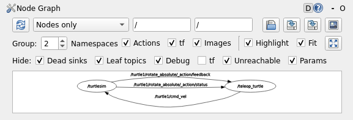

# 학습일지 2026-07-24 (Week 1, 공통교육 2일차)

## 오늘 배운 것

- ROS2의 기본 통신 구조인 노드, 토픽, 서비스, 메시지에 대해 배웠다.
- 리매핑을 이용하면 코드를 수정하지 않고도 토픽 등의 연결 이름을 변경할 수 있다.
- 실제 발행자가 실행되고 있지 않아도 `ros2 bag`으로 녹화한 데이터를 재생하면 listener가 과거의 메시지를 다시 받을 수 있다.
- 빌드는 작성한 소스 코드를 ROS2가 찾아 실행할 수 있는 형태로 정리하고 준비하는 과정이다.
- 패키지는 관련된 ROS2 코드와 설정을 한데 묶어 관리하는 기본 단위이며, 하나의 패키지 안에 여러 노드 프로그램이 포함될 수 있다.
- launch 파일은 여러 노드를 한 번에 실행하고 종료하기 위해 사용한다.
- 파라미터는 노드의 설정값이며, 코드를 수정하거나 재빌드하지 않아도 실행 중에 값을 변경할 수 있다.
- TF tree의 부모-자식 관계는 자식 좌표계가 부모 좌표계를 기준으로 어디에 위치하고 얼마나 회전되어 있는지를 의미한다.

## 직접 해본 것 / 성공한 것

- `ros2 topic pub` 명령을 사용해 터미널이 직접 발행자 역할을 하도록 만들었다.
- turtlesim 실습에서 `linear.x`와 `angular.z`를 동시에 설정해 거북이가 원을 그리며 움직이도록 했다.
- `rqt_graph`를 통해 `teleop → /turtle1/cmd_vel → turtlesim`의 연결 관계를 확인했다.

- ROS2 패키지를 만들고 발행 노드인 `greeter.py`와 구독 노드인 `replier.py`를 작성했다. `setup.py`에 각 실행 파일을 등록한 뒤 패키지를 빌드하고 실행했다. 완성한 ROS2 패키지를 GitHub 저장소에 push했다.
- view_frames명령을 이용하여 현재 시스템의 TF tree를 pdf파일로 저장하였다.
[TF tree PDF 열기](../images/tf_tree.pdf)

## 막힌 것 / 이해가 안 되었던 것

- 패키지를 빌드한 후 다른 터미널에서 확인할 때도 `source`를 다시 실행해야 하는 이유가 궁금했다. 각 터미널은 서로 독립적인 환경이기 때문에 새 터미널에서도 빌드된 패키지의 위치를 알려주기 위해 `source`를 실행해야 한다는 것을 이해했다.
- `driver.py`에서 `Twist`를 사용하기 위해 `package.xml`에 `geometry_msgs` 의존성을 추가해야 하는 이유가 처음에는 이해되지 않았다. `Twist` 메시지가 `geometry_msgs` 패키지에 포함되어 있으므로, 해당 패키지를 사용한다는 사실을 `package.xml`에 기록해야 한다는 것을 이해했다.
- tf2와 RViz2의 관계가 아직 완전히 이해되지 않았다. tf2는 좌표계 사이의 위치와 회전 관계를 관리하고, RViz2는 tf2의 좌표 변환 정보를 이용해 로봇과 센서 데이터를 올바른 위치에 시각화한다는 것을 알게되었다.

## 한 줄 소감

- 패키지를 만드는 과정이 처음에는 어려웠지만, 직접 발행 노드와 구독 노드를 만들고 turtlesim 실습을 진행하면서 ROS2의 전체적인 구조가 조금씩 이해되기 시작했다.
