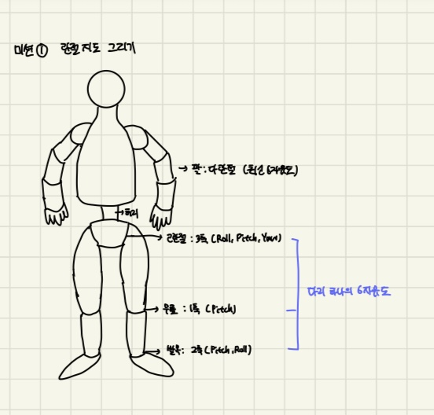

# G1 2장 자율학습 미션 - 몸으로 익히는 균형

## 미션 1 - 관절 지도 그리기

## 미션 2 - 지지 영역 체감 실험

### ㄱ 두 발로 벌리고 서기 vs 두 발을 붙이고 서기
두 발을 어깨 너비로 벌리고 서 있을 때가 옆 방향으로 더 안정적이다.
두발을 벌리면 두 발바닥과 그 사이가 만드는 지지영역이 좌우로 넓어져 몸의 무게 중심이 좌우로 약간 움직여도 지지영역을 쉽게 벗어나지 않기 때문이다.

### ㄴ 한 발로 서기
한 발로 서면 몸이 흔들리고 특히 팔을 벌리거나 상체를 반대방향으로 기울이게 된다. 그리고 지면을 딛고 있는 발바닥 안에서 힘이 계속 이동하는 것이 느껴진다.
한 발로 서면 지지 영역이 발바닥 하나로 두 발로 서 있을때보다 좁아진다. 팔을 벌리거나 상체를 반대방향으로 기울이는 것은 무게중심을 좁은 지지영역 안에서 유지하기위한 자세보상이다.

### ㄷ 서서 상체만 천천히 앞으로 기울이기
처음에는 발바닥 전체로 버틸 수 있지만 몸을 앞으로 더 기울수록 발가락 쪽에 힘이 많이 들어가고 더 기울이면 한쪽 발이 앞으로 나간다.
몸을 앞으로 기울면 무게중심도 앞으로 이동하기 때문에 처음에는 균형을 유지하는 자세보상으로 버티다가 무게중심이 지지영역을 벗어나면 발이 앞으로 나가며 무게중심 아래에 새로운 지지영역을 만든다.

## 미션 3 - Go2 와 G1 대응표
| Go2 주간에서는 | G1 주간에서는 |
|---|---|
|topic list로 토픽지도부터 그렸다.| ros2 topic list로 상태 토픽을 조사하고 ROS2 토픽에 보이지 않는 명령은 SDK경로까지 확인하여 데이터 흐름지도를 그린다.  |
|Gazebo에서 검증 후 실기체 | MuJoCo에서 검증 후 실기체 |
|StandUp->대기->Move->StopMove | 현재 상태 확인->상태 전이 명령->전이 완료 대기->안전 상태 복귀 |
|잘못되면 리모컨이 코드보다 우선 | 리모컨과 비상정지가 코드보다 우선 |

## 미션 4 - 상태 전이 판별 연습

### 가 행어 거치,준비 자세에서 기립 명령
준비자세에서 기립 상태로 이동하는 것은 정해진 상태 순서로 안전한 전이이다.

### 나 엎드린 상태에서 곧바로 보행 명령
엎드린 상태에서 보행에 필요한 기립과 균형상태가 형성되지 않아 바로 보행하지 못하므로 안전한 전이가 아니다.

### 다 보행 중 비상정지
보행 중 이상동작이 발생하면 리모컨의 비상정지가 코드보다 우선이므로 안전한 전이이다.

### 라 기립 상태에서 팔 모션 명령
기립상태에서는 정해진 팔 모션 실행할 수 있으므로 안전한 전이이다.

## 도전 미션
Unitree 공식 사양(https://www.unitree.com/g1)
G1: 23자유도, 약 130cm, 약 35kg, 팔은 5자유도
G1 EDU: 옵션 구성에 따라 23에서 43자유도를 가진다.

## 조별 안전 물리 설명
G1은 무게중심이 높고 지지영역이 좁아 작은 기울어짐에도 빠르게 변화한다. 그리고 약 35kg의 질량으로 넘어질 경우 큰 충격을 줄 수 있어 보행시 반경 2m 확보, 행어거치, 비상정지 전담이 필요하다.
